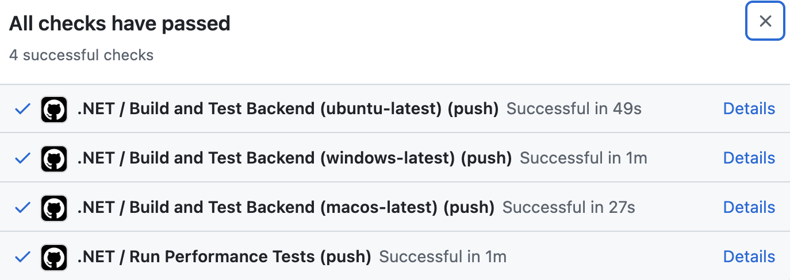

# Collectify App

## Team Members
- Dogăreci Bianca Alexandra
- Iscru Bianca
- Glazov Liana Maria
- Pericică Medeea
- Potlog Ioana
- Roșu Gabriel

## 💡 Product Vision
### FOR
Individuals who need an efficient way to manage and share their notes.

### WHO
Users who value the ability to share their thoughts, reminders, purchasing preferences and to-do lists effortlessly.

### WHAT
Collectify is a note-taking platform that provides a seamless way to create, organize, and share groups of notes.

### UNLIKE
Unlike traditional note-taking apps that lack collaborative features.

### OUR PRODUCT
Our product delivers a personalized, shareable organization experience, making it easy to manage notes with family, friends, or colleagues.

## 📲 Demo

https://github.com/user-attachments/assets/e0bde9f6-ca12-4dba-959c-32b0ad626866

https://github.com/user-attachments/assets/45cd9f37-f997-4f7e-ae23-5b4d5d260135

## 🕹️ How to use QR Scanner
1) Go to the group you want to add the new person and press the 'Show QR Code' button
- screenshot the Qr Code using the camera icon from the right side of the emulator( it should save on your desktop)
- log out

2) Log in with the user you want to add to the group
-  click the 3 dots from the right side of the emulator('More')
-  click 'Camera' from the left side menu
-  click 'Add Image' for the Wall and select the wanted Qr Code( ! do this every time you want to add a new Qr Code )
-  then in the app click the 'Scan QR'
-  welcome to the virtual scene! how to move:
    - Hold Alt + Mouse to rotate
    - Hold Alt + W/A/S/D/Q/E keys to move
-  enter the room where you see the Qr Code displayed
-  stop there and you should be added to the group. Done!

## 📬 Issues
### User story: As a user, I want to be able to create an account so that I can access personalized features.
#### Requirements:
- Implement a "Register" button on the initial page;
- Create input fields for users to enter their registration details;
- Create backend API endpoints for user registration;
- Store user credentials securely using encryption;
- Validate user input for account creation.

### User story: As a user, I want to be able to log into my account so that I can access my saved data and preferences.
#### Requirements:
- Implement a "Login" button on initial page;
- Create input fields for users to enter their details;
- Create backend API endpoints for authentication;
- Implement session management and token-based authentication;
- Ensure password hashing for security.

### User story: As a user, I want to add a profile picture and nickname to my account.
#### Requirements:
- Implement frontend UI to upload profile pictures;
- Create an input field for users to enter their nickname;
- Create an API endpoint to store and retrieve profile images.

### User story: As a user, I want to be able to create notes and groups/spaces that only I can access.
#### Requirements:
- Implement frontend UI for creating and managing personal notes and groups/spaces;
- Ensure secure access control.

### User story: As a user, I want to create groups/spaces with notes that can be shared with other users of the application.
#### Requirements:
- Implement a frontend UI for group/space creation and management;
- Allow users to invite others to groups/spaces via QR code.

### User story: As a user, I want to be able to change the name of my notes.
#### Requirements:
- Implement frontend UI to rename notes;
- Create backend API for updating note data.

### User story: As a user, I want to be able to update the content of a note.
#### Requirements:
- Implement a text box to allow users to modify the content of a note.
- Create a backend API endpoint to update the content of a note.
- Ensure automatic saving of user changes in real time.

### User story: As a user, I want to be able to change the name of my groups/spaces.
#### Requirements:
- Implement UI for editing group/space names;
- Develop backend API to update group/space data.

### User story: As a user, I want to be able to create an unlimited number of notes within a group/space.
#### Requirements:
- Implement a "New note" button that allows users to add an unlimited number of notes within a group/space.
- Create a backend API endpoint to manage the addition of notes within a group/space.

### User story: As a user, I want to be able to delete notes, groups/spaces and notes within a group/space.
#### Requirements:
- Implement a delete button for notes and groups/spaces;
- Develop backend API for deleting notes and groups/spaces securely.

### User story: As a user, I want to add members to my group/space by scanning a QR code to share access.
#### Requirements:
- Implement QR code generation and scanning functionality;
- Create backend API for user access management.

### User story: As a user, I want to be able to see a list with all the members of a group/space so that I know who has access to it.
#### Requirements:
- Implement a page to display group members;
- Create backend API for fetching members of a group.

### User story: As a user, I want to be able to remove a member from a group/space.
#### Requirements:
- Implement a delete button to remove members;
- Create backend logic for deleting members from groups/spaces.

### User story: As a user, I want the application to be visually appealing and easy to use so that I can navigate it effortlessly.
#### Requirements:
- Design a user-friendly interface with clear navigation menus and icons.

## 👤 User Personas

### 1.	Christiana, medical assistant
Christiana, age 46, is a medical assistant at a clinic in Portugal, where she lives with her husband and their 2 children, ages 21 and 19. She earned her bachelor’s degree at a university in Spain before returning home, where she got her first job at a hospital. After five years there, she decided to switch to a private clinic for a more flexible schedule to spend time with her family.
Christiana uses technology to stay in touch with her children and for everyday apps that make her life easier, like recipe apps, navigation and scheduling tools. She is interested in using Collectify to share a grocery list with her husband, so that they can keep it updated whenever one of them goes shopping. She might also create a shared wish list with her children, since surprises aren't as important at their ages, and this list helps her stay prepared for birthdays and holidays with gifts they truly want.

### 2.	Emily, middle-schooler
Emily, age 13, is a middle school student in Manchester, where she lives with her family. She has lived there since birth. Her parents enrolled her in a prestigious school known for its well-structured programs and high expectation. Although her weekdays are busy, she loves spending weekends with her friends, often going to the park.
Even though her parents are programmers,  Emily is more interested in literature, and would like to persue college studies in this field. She has her own phone, but isn’t particularly interested in technology. She might use Collectify to have a shared space with her family, where she can keep track of the materials required for school.

### 3.	Sophia, High School Student
Sophia, age 17, is a high school student in Lisbon, where she lives with her family. At school, she is a dedicated student with a particular interest in languages and history. She’s considering a career in media or communications, fields that match her love for connecting with others and staying informed. Outside of schoolwork, she is passionate about photography and loves capturing moments with her friends. She is very social and enjoys spending time with her group of friends, whether at school, at the mall, or on weekends. 
Sophia is an active social media user, and technology is a big part of her daily life. She uses her phone to stay connected and keep up with trends. She is interested in using Collectify’s spaces, to create shared lists with her friends to organize gift ideas and track contributions. Since she only needs these lists for specific occasions, she prefers the flexibility to delete them once the event is over. 

## 🧾 Product Features

## 🛠️ Architectural Description

### Technologies Used

The architecture of our application that consists of three main components:
- Backend (.NET API)
- Frontend (React Native with Expo)
- Database (Microsoft SQL Server)

### Backend – .NET API
.NET provides high performance and scalability, which are essential for handling multiple users and large amounts of data.

Supports RESTful APIs, making communication with the frontend straightforward.

### Frontend – React Native with Expo
We chose React Native because it allows cross-platform development, meaning we can write one codebase for both Android and iOS.

We used the Expo framework, as it was recommended on the official site, especially for beginners, because it simplifies the setup and development workflow.

We used UI Kitten, a React Native UI framework, for styling and components because it provides a consistent design system with predefined, customizable UI components and it simplifies development by offering ready-made components like buttons, input fields, lists, reducing the need for custom styling.

### Database – Microsoft SQL Server
We used it because it is a relational database that allows efficient structuring of user data, notes, and collections.

It provides strong security features, ensuring that user information and notes are protected.

### How Everything Connects
The user interacts with the React Native app, built with Expo and UI Kitten.

The frontend sends API requests to the .NET backend using JSON/HTTP.

The backend API processes the request, updates the Microsoft SQL Server database, and sends a response.

The frontend updates the UI based on the response, ensuring a seamless user experience.

## 📊 C4 Diagrams
You can find them [here](https://github.com/unibuc-cs/software-engineering-product-pingbing/tree/main/diagrams).

## 🖇️ Requirements

### Functional requirements:

#### User Management
- Users must be able to register, by creating an account using an email and password.
- Users must be able to log in securely and access their personal notes and groups.
- Users must be able to view and edit their profile, including adding a profile picture and nickname.

#### Notes and Groups Management
- Users must be able to create, edit, and delete notes.
- Users must be able to update the title and content of a note.
- Users must be able to group notes into collections or spaces for better organization.
- Users must be able to share groups/spaces with other users.

#### Collaboration & Sharing
- Users must be able to invite other users to a group/space via a QR code.
- Users must be able to view a list of all members in a group/space.
- Users must be able to remove a member from a shared group/space.
- Users must be able to delete groups/spaces, including all contained notes.

### Non-functional requirements:

#### Security
- The system must use secure authentication with password hashing and encryption.
- User data must be stored securely in Microsoft SQL Server.
- API endpoints must use secure authentication tokens.
- User access to notes and groups/spaces must be restricted based on permissions.

#### Compatibility
- The app must work on both Android and iOS, built using React Native with Expo.
- The UI should be responsive and work across various screen sizes.

#### Scalability
- The backend, built in .NET, must be designed to handle increasing user traffic.

#### Usability
- The frontend uses UI Kitten, ensuring a consistent and user-friendly interface.
- Navigation is intuitive, with clear buttons, labels, and tooltips.
- User feedback mechanisms, like: error and confirmation messages are implemented.

#### Reliability
- The app's features are tested using unit and integration testing to ensure they behave as expected.
- The backend uses exception handling to prevent crashes and ensure smooth operation.

## 📈 Backlog
We used GitHub Projects to efficiently manage the development process of the Collectify app. You can view the project backlong by clicking [here](https://github.com/orgs/unibuc-cs/projects/62/views/1).

## ✅ QA
To ensure the reliability and performance of the Collectify app, we implemented a comprehensive testing strategy that includes unit tests, integration tests, performance tests, and manual testing. 

### Testing Methods Used

### 1. Unit Tests

#### 🎯 Purpose: 
The unit tests are used to validate the functionality of individual backend components, ensuring that controllers and services work as expected.

#### 📍 Location: 
- CollectifyAPI/CollectifyAPI.Tests/ControllersTests;

#### 🔍 Testing Approach:
Each unit test focused on a single function or method, verifying that it returns the expected results. Key Areas Tested:
- User Authentication: Verifying that login, registration, and token generation function correctly.
- Note Management: Ensuring that notes can be created, updated, deleted, and retrieved properly.
- Group Management: Testing functionalities related to creating, modifying, and deleting groups.

### 2. Integration Tests

#### 🎯 Purpose: 
The integration tests verify how multiple components interact, especially API endpoints.

#### 📍 Location: 
- CollectifyAPI/CollectifyAPI.Tests/IntegrationTests;

#### 🔍 Testing Approach:
Key Areas Tested:
- Authentication Handling: Before running tests, ensure users are registered and authenticated, so that only authorized actions are performed.
- CRUD Operations Testing: The tests cover creating, retrieving, updating, and deleting both groups and notes, validating that the API functions correctly.
- Error Handling & Response Validation: Ensures the API returns correct status codes and error messages when encountering invalid or unauthorized requests.

### 3. Performance Tests

#### 🎯 Purpose: 
The performance tests evaluate the app’s behavior under high traffic and load conditions. It ensures the system can handle multiple users without slowdowns or failures.

#### 🔨 Tools Used: k6

https://github.com/user-attachments/assets/1304a2e0-053f-46b8-802d-c0406923ff8e

### 4. Manual Tests

#### 🎯 Purpose: 
The manual tests helped us identify unexpected failures, UI issues, and usability problems that automated tests might not cover all the time. This helped ensure a smooth user experience and proper error handling across different scenarios.

#### 🔍 Testing Approach:
We performed a series of test cases by interacting with the application as an end user. The key focus areas included:
- Pressing all buttons to ensure they triggered the correct actions.
- Navigating through different screens to validate UI responsiveness and transitions.
- Entering various inputs, including valid, invalid, and edge-case data, to test form validation and error handling.

#### ✅ Findings and Fixes:
- When adding a new note, the UI did not immediately reflect the update. ✅
- After navigating to the login page, the back button did not return the user to the home page as expected. ✅

## 🔐 Security Analysis

Security is a key aspect of our app to protect user data and prevent unauthorized access. Below are the main security concerns and our solutions:

### 1. Weak Passwords Exploitation

Risk:

Users may set weak passwords that attackers can easily guess through brute-force or dictionary attacks. If an attacker gains access to a user's account, they could manipulate or steal sensitive notes.

Solution:

💡 Enforce minimum password complexity requirements, including:
- At least 8 characters;
- Upper and lowercase letters;
- At least one number and special character;

### 2. Unauthorized Access to Groups
Risk:

Users who are not part of a group or shared space may gain unauthorized access to notes.

Solution:

💡 Implement authentication tokens (JWT - JSON Web Tokens) to verify user identity.

### 3. Server Exposure to External Threats
Risk:

Attackers could try to gain unauthorized access to our backend API or database.

Solution:

💡 Use secure hosting with Nginx as a reverse proxy to filter external requests.

💡 Restrict database access to allow queries only through the backend API, preventing direct external connections.

💡 Encrypt stored notes to add an extra layer of security.

### 4. Network Packet Interception (Man-in-the-Middle Attacks)
Risk:

Attackers could intercept network traffic between the app and the backend, exposing sensitive data.

Solution:

💡 Enforce HTTPS (SSL certificates) for all API requests to encrypt data in transit.

### 5. Unauthorized API Requests
Risk:

Attackers could forge API requests to access or modify data without proper authorization.

Solution:

💡 Implement JWT-based authentication for API requests, including: 
- User ID
- Security key
- Token expiration to prevent replay attacks

💡 Require valid API keys for backend requests.

### Improvements that can be made:

#### 1. Implement the ability to change the password
Current limitations: Users cannot update their passwords after account creation, which is a security risk.

Recommendations: Provide a "Change Password" option in the user profile settings. Also, require authentication before allowing a password change (enter old password + new password).

#### 2. Brute force protection
Current Limitations: Users have no rate limiting for login attempts, making the system vulnerable to brute force attacks.

Recommendations: Implement rate limiting (max 5 attempts per 10 seconds) and introduce temporary account lockout after multiple failed login attempts.

## 🔗 CI/CD
 
### GitHub Actions Workflow (.NET Backend CI/CD)
We implemented a .NET GitHub Actions workflow (dotnet.yml) to automate the testing process.

#### Features of Our Workflow:
- Runs on push and pull requests to the main branch.
- Supports multiple OS environments (Ubuntu, Windows, macOS).
- Restores, builds, and tests the .NET backend.
- Runs unit and integration tests with logs stored as artifacts.
- Performs performance testing using k6.

### Feature Branch Strategy
We use feature branches to develop specific features independently before merging into main.

Workflow:
- Developers create a new feature branch;
- Code is reviewed through pull requests (PRs) before merging;
- The CI/CD pipeline automatically tests the changes;
- Once approved, the branch is merged into main.
